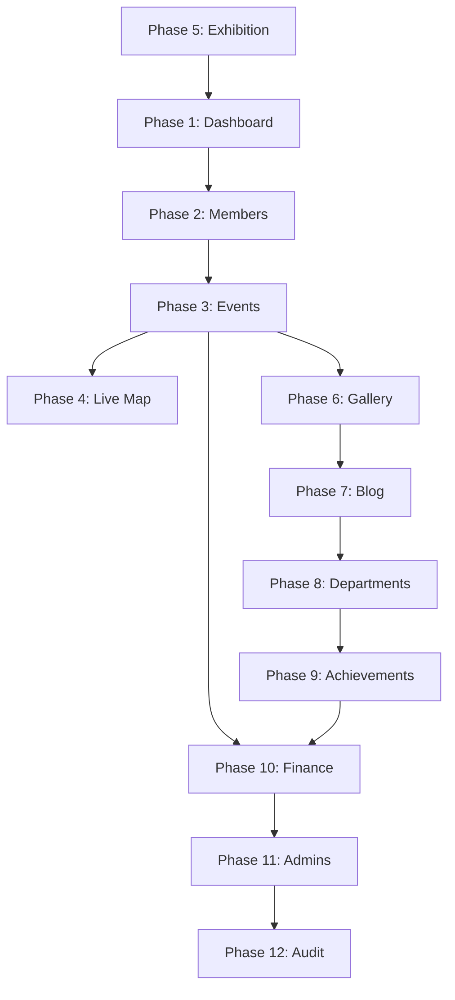

# UIUPC Admin Panel — 100% COMPLETE

> **Design Reference**: The **Committee page** (`Admin_Committee.tsx`) is the gold standard. All pages must follow its compact table layout, stat cards, filter system, responsive breakpoints, and overall design language.

> **Universal Rule**: Every phase must ensure full mobile responsiveness — no text overflow, no horizontal scroll on tables, no broken layouts on small screens.

---

## Phase 1 — Dashboard (Overview Page)

### Current State
- `OverviewContainer.tsx` shows placeholder analytics (14-day bar chart from Supabase member/submission data)
- Has a "Security Feed" sidebar with audit logs
- Quick-access footer cards (Access Governance, System Integrity) are non-functional
- Not mobile-responsive — text sizes and bento layout overflow on small screens

### What Needs to Happen

**1.1 — Restructure into Internal Tabs**
- Add two tabs inside the dashboard: **Analytics** and **Controls**
- Use a tab switcher matching Committee page styling (compact pill buttons)

**1.2 — Analytics Tab**
- Keep the existing Membership Growth chart but fix mobile overflow
- Add real data cards:
  - Total Members (from `members` table)
  - Total Events (from `events` table)
  - Total Gallery Photos (from `gallery` table)
  - Total Blog Posts (from `blog_posts` table)
- Investigate Google Search Console / Site Kit integration for:
  - Total unique visitors
  - Average time on page
  - Total impressions
  - Total clicks
- If external analytics cannot be embedded directly, add a placeholder card that links to the Google Search Console dashboard with a note for future integration
- Keep the Security Feed sidebar but make it collapsible on mobile

**1.3 — Controls Tab**
- Toggle switches for website-level controls:
  - **Join Page**: On/Off (controls whether `/join` accepts new applications)
  - **Submissions**: On/Off (controls whether exhibition submission form is active)
  - **Maintenance Mode**: On/Off (shows a coming soon page to visitors)
- Store these toggles in a new `site_settings` table in Supabase (key-value pairs)
- Each toggle must update the database and reflect instantly
- More controls can be added later — build the system to be extensible

**1.4 — Mobile Responsiveness**
- Bento grid must stack to single column on mobile
- All text must scale properly — no overflow
- Security Feed must be scrollable within its container

### Files to Modify
- `src/app/admin/OverviewContainer.tsx` — Full rewrite
- `src/app/admin/page.tsx` — Update data fetching if needed
- New: `site_settings` table in Supabase

### Frontend Connection
- The Controls tab toggles will directly affect `/join` and `/register` pages behavior

---

## Phase 2 — Members Page

### Current State
- `Admin_Members.tsx` has 4 stat cards: Total Records, Filter Status, Department, Departments count
- Table has large padding (`px-8 py-4`), large row heights, and `min-w-[200px]` on name columns
- Horizontal scroll exists due to oversized cells
- "Status" column takes up space but is not essential
- Filters do not match Committee page pattern

### What Needs to Happen

**2.1 — Stat Cards Restructure**
- **Keep**: 1st card (Total Members)
- **Remove**: 2nd card (Application Status filter) — replace with Committee-style `Admin_FilterMenu`
- **Remove**: 3rd card (Department dropdown) — replace with Committee-style **Session Year** card
- **Remove**: 4th card (Departments count) — not useful

**2.2 — Add Committee-style Filters**
- Add a "Quick Filters" card (identical to Committee page) using `Admin_FilterMenu`
- Add a "Session Year" card (identical to Committee page) with `Admin_Dropdown`
- Filter options: Department filter moves inside `Admin_FilterMenu`

**2.3 — Table Compaction**
- Reduce all padding to match Committee page (`px-4 py-3` instead of `px-8 py-4`)
- Reduce checkbox size from `w-5 h-5` to `w-4 h-4`
- Reduce avatar from `w-12 h-12` to `w-9 h-9`
- Remove `min-w-[200px]` and `min-w-[150px]` constraints
- **Remove "Status" column** to free horizontal space
- Make student name **clearly visible** — use same truncation pattern as Committee page
- Font sizes: match Committee page (`text-[12px]` for names, `text-[9px]` for labels)
- Remove horizontal scroll — table must fit without it

**2.4 — Mobile Responsiveness**
- Hide Student Info and Academic Batch columns on small screens (already partially done)
- Ensure action buttons are compact and accessible

### Files to Modify
- `src/features/admin/components/modules/Admin_Members.tsx` — Major refactor
- `src/app/admin/members/page.tsx` — Update props to pass session year data

### Frontend Connection
- No changes to public-facing pages

---

## Phase 3 — Events Page

### Current State
- `Admin_Events.tsx` has basic CRUD with a form modal
- Event form includes: title, description, cover image (Drive picker), date, location, category, status, map pin toggle
- Missing: timer/countdown functionality, event tags, post-event image uploads
- No connection to frontend `/events` page sections (Upcoming, Recently Concluded, More Events)

### What Needs to Happen

**3.1 — Event Data Model Expansion**
- Add new fields to the `events` table:
  - `tags` (text array — for controlling which events appear in "More Events")
  - `countdown_target` (timestamp — for upcoming event countdown timers)
  - `show_in_more_events` (boolean — admin toggle)
  - `event_images` (text array — post-event photo Drive IDs)

**3.2 — Enhanced Event Form**
- Add **Tags** input (multi-select chips: "featured", "flagship", "workshop", etc.)
- Add **Countdown Timer** date-time picker for upcoming events
- Add **Post-Event Images** section (appears only when status is "completed"):
  - Drive picker to select multiple images
  - Preview grid of selected images
  - Ability to remove individual images

**3.3 — Table Compaction**
- Match Committee page table density
- Reduce padding and font sizes
- Remove horizontal scroll

**3.4 — Frontend Wiring**
- **Upcoming Events slot**: Query events where `status = 'upcoming'`, show with active countdown timer
- **Recently Concluded slot**: Query the most recent event where `status = 'completed'`, link to its detail/gallery
- **More Events slot**: Query events where `show_in_more_events = true` or matching specific tags
- All three sections on `/events` must pull live data from the `events` table

**3.5 — Mobile Responsiveness**
- Event form modal must be fully scrollable and usable on phone
- Table must not overflow

### Files to Modify
- `src/features/admin/components/modules/Admin_Events.tsx` — Major enhancement
- `src/app/admin/events/page.tsx` — Update data flow
- `src/features/events/` — Frontend events page components
- Supabase: Alter `events` table schema

### Frontend Connection
- Direct sync with `/events` page — all three sections

---

## Phase 4 — Live Map Page

### Current State
- `Admin_EventMap.tsx` and `InteractiveEventMap.tsx` exist with MapLibre GL integration
- Events can be toggled as "mapped" with lat/lng coordinates
- Map icon type selection exists
- Missing: marker color selection, direct link from marker to event page

### What Needs to Happen

**4.1 — Tight Integration with Events Page**
- When an event is created in Phase 3, it should automatically appear in the Live Map list
- Remove the need to separately "create" map entries — they derive from events

**4.2 — Enhanced Marker Customization**
- Add marker **color picker** (preset palette matching club branding)
- Add marker **link URL** field (auto-populated with `/events/[event-id]`)
- When a marker is clicked on the frontend map, it navigates to that event's page

**4.3 — Admin Map Preview**
- The admin page should show a live preview of the map with all current markers
- Ability to drag markers to adjust position
- Real-time update — changes reflect immediately on frontend

**4.4 — Table/List Compaction**
- Match Committee page design for the event list alongside the map
- Compact cards instead of large rows

**4.5 — Mobile Responsiveness**
- Map must be touch-friendly and zoomable on mobile
- Event list must stack below map on small screens

### Files to Modify
- `src/features/admin/components/modules/Admin_EventMap.tsx` — Enhancement
- `src/features/admin/components/modules/InteractiveEventMap.tsx` — Enhancement
- Supabase: Add `marker_color` column to `events` table

### Frontend Connection
- Direct sync with the map section on `/events` page

---

## Phase 5 — Exhibition (Submissions) Page

### Current State
- `Admin_Submissions.tsx` has a functional table with category filter, bulk email, hero toggle
- Categories: Single, Story, Mobile
- Missing: Google Drive integration for image uploads, payment handling, submission controls

### What Needs to Happen

**5.1 — Submission Controls**
- Add a toggle (synced with Dashboard Controls) to open/close submissions
- When submissions are closed, the frontend form shows a "Submissions Closed" message

**5.2 — Google Drive Integration**
- Each submission should display a link to the submitted photos in Google Drive
- Admin should be able to open the Drive folder directly from the submission row

**5.3 — Payment Handling**
- Add payment status column: `paid`, `unpaid`, `verified`
- Add payment amount field
- Add transaction ID field
- Admin can verify payments and mark them as confirmed
- Add a "Payment" filter to the stat cards (like Committee's Quick Filters)

**5.4 — Enhanced Detail Modal**
- When viewing a submission, show:
  - All participant details
  - Photo previews (from Drive)
  - Payment status and transaction details
  - Quick approve/reject actions

**5.5 — Table Compaction**
- Match Committee page density
- Ensure all columns fit without horizontal scroll

**5.6 — Mobile Responsiveness**
- Table and modals must work perfectly on phone screens

### Files to Modify
- `src/features/admin/components/modules/Admin_Submissions.tsx` — Major enhancement
- `src/app/admin/submissions/page.tsx` — Update data flow
- Supabase: Add payment columns to `exhibition_submissions` table

### Frontend Connection
- Controls the submission form on `/register` pages
- Submission open/close toggle syncs with frontend

---

## Phase 6 — Gallery Page

### Current State
- `Admin_Gallery.tsx` has CRUD with event-based filtering (hardcoded EVENT_MAP)
- Hero toggle (`featured_on_hero`) exists
- Gallery modal for adding/editing photos
- Missing: Dynamic event connection, Drive folder integration, hero section management

### What Needs to Happen

**6.1 — Dynamic Event Connection**
- Replace hardcoded `EVENT_MAP` with live data from the `events` table
- When filtering by event, show only photos from that event
- Photos should be linkable to their source event

**6.2 — Drive Folder Workflow**
- For each event, admin creates a Google Drive folder
- Use Drive picker to select the folder
- Import all images from that folder into the gallery under that event
- Each photo gets: title, description, event association, hero toggle

**6.3 — Hero Section Management**
- Add a dedicated "Hero Manager" sub-section or card
- Show count of currently featured images (target: 30-40)
- Quick toggle to feature/unfeature images
- Preview of how the hero section will look

**6.4 — Table Compaction**
- Match Committee page density
- Remove horizontal scroll

**6.5 — Mobile Responsiveness**
- All modals and tables must be phone-friendly

### Files to Modify
- `src/features/admin/components/modules/Admin_Gallery.tsx` — Major enhancement
- `src/features/admin/components/modules/Admin_GalleryModal.tsx` — Update
- `src/app/admin/gallery/page.tsx` — Update data flow

### Frontend Connection
- `/gallery` page: hero section shows `featured_on_hero = true` images
- `/gallery` page: clicking "more" from an event opens that event's gallery
- `/events` page: concluded events link to their gallery

---

## Phase 7 — Blog Page

### Current State
- `Admin_Blog.tsx` has full CRUD with multi-media support, author filtering, preview modal
- Blog posts have: title, description, date, media array, tags, author, slug
- Missing: Drive picker for images, external link fields (Facebook, Instagram, LinkedIn)

### What Needs to Happen

**7.1 — Add External Links**
- Add fields to blog post form:
  - Facebook post URL
  - Instagram post URL
  - LinkedIn post URL
- Store in a `social_links` JSON field on `blog_posts` table

**7.2 — Drive Picker for Images**
- Replace manual URL input in the blog post modal with Drive picker
- Keep the option to manually paste a URL as fallback

**7.3 — Table Compaction**
- Match Committee page table density
- Reduce padding and font sizes

**7.4 — Mobile Responsiveness**
- Blog post modal must be fully scrollable on mobile
- Table must not overflow

### Files to Modify
- `src/features/admin/components/modules/Admin_Blog.tsx` — Enhancement
- `src/features/admin/components/modules/Admin_BlogPostModal.tsx` — Add Drive picker + social links
- Supabase: Add `social_links` column to `blog_posts` table

### Frontend Connection
- Posts automatically appear on `/blog` page
- Social link buttons appear on individual blog cards

---

## Phase 8 — Departments Page

### Current State
- `Admin_Departments.tsx` shows department cards with CRUD (grid layout)
- Fields: name, display_name, description, icon
- Missing: Per-department content management, Design/Visual team portfolio system

### What Needs to Happen

**8.1 — Per-Department Content Management**
- Each department card should expand or link to its own management view
- Inside each department view, admin can:
  - Post department-specific content (like blog cards — title, description, image)
  - Manage department achievements
  - Upload departmental images via Drive picker

**8.2 — Design & Visual Team Special Pages**
- For "Design" and "Visual" teams, add a **Portfolio Manager**:
  - List all members of that team
  - For each member, manage their portfolio:
    - Member name and details
    - Work done for UIUPC (image gallery with Drive picker)
    - External portfolio links (Behance, personal website, etc.)
  - This creates pages like `/design/pulok-sikdar` and `/visual/member-name`

**8.3 — Database Schema**
- New table: `department_posts` (title, description, image, department_id, created_at)
- New table: `team_portfolios` (member_name, slug, department_id, bio, works JSON, external_links JSON)

**8.4 — Card Compaction**
- Match Committee page design language for cards
- Ensure grid is responsive

**8.5 — Mobile Responsiveness**
- Department grid must stack to single column on mobile
- Portfolio manager must be fully usable on phone

### Files to Modify
- `src/features/admin/components/modules/Admin_Departments.tsx` — Major expansion
- New components for department detail view and portfolio manager
- `src/app/admin/departments/page.tsx` — Update routing
- Supabase: Create new tables

### Frontend Connection
- Each department has its own archive page on the frontend
- Design and Visual teams have member portfolio pages (`/design/[slug]`, `/visual/[slug]`)

---

## Phase 9 — Achievements Page

### Current State
- `Admin_Achievements.tsx` has CRUD with table display
- Fields: title, description, year, category, image_url, recipient, order_index
- Drive picker exists for image selection
- Functional and mostly complete

### What Needs to Happen

**9.1 — Table Compaction**
- Match Committee page table density (reduce padding, font sizes)
- Remove horizontal scroll

**9.2 — Frontend Sync Verification**
- Ensure achievements appear correctly on the frontend `/achievements` page
- Each achievement should display: title, description, image, year

**9.3 — Mobile Responsiveness**
- Table and modals must work on phone
- Achievement form modal must scroll properly

### Files to Modify
- `src/features/admin/components/modules/Admin_Achievements.tsx` — Compact styling
- Frontend achievements page — verify sync

### Frontend Connection
- Auto-syncs with `/achievements` page

---

## Phase 10 — Finance Page

### Current State
- `Admin_Finance.tsx` is feature-rich with:
  - Net Treasury display, Income/Expense breakdown
  - Transaction cards with category, amount, date, receipt link
  - Add transaction modal with type, category, amount, description, date, receipt URL
  - Core-only access restriction
- Categories: membership_fee, sponsor, event_expense, equipment, other
- Missing: Event-based finance separation, receipt image uploader, edit/delete transactions

### What Needs to Happen

**10.1 — Edit and Delete Transactions**
- Currently only "add" exists — need edit and delete functionality
- Each transaction card needs edit/delete action buttons
- Delete must require password confirmation (like Committee page)

**10.2 — Event-Based Finance**
- Add an "Event" field to transactions (optional, links to events table)
- When viewing an event's finances, filter transactions by that event
- Show event-specific subtotals
- The central balance remains one source of truth

**10.3 — Receipt Image Uploader**
- Replace the "Google Drive / Media Link" text input with a proper **file uploader**
- Upload receipts to Supabase Storage (not Drive — user specified this)
- Show receipt thumbnail preview after upload

**10.4 — Category Expansion**
- Add categories: `merchandise`, `university_support`, `transport`, `food`, `printing`
- Make categories extensible (admin can add custom categories later)

**10.5 — Table/Card Compaction**
- Match Committee page design density
- Transaction cards should be more compact on mobile

**10.6 — Mobile Responsiveness**
- All financial data must be readable on phone
- Transaction modal must be fully usable on mobile

### Files to Modify
- `src/features/admin/components/governance/Admin_Finance.tsx` — Major enhancement
- Supabase: Add `event_id` column to `finances` table, update categories

### Frontend Connection
- Connects with Events page for event-level financial tracking

---

## Phase 11 — Admins (Access Control) Page

### Current State
- `Admin_Access.tsx` has basic CRUD for admin accounts
- Roles: `core` and `moderator` only
- Core-only access restriction
- Add admin form: email, display_name, role
- Missing: Departmental roles, request system, permission scoping, approval workflow

### What Needs to Happen

**11.1 — Expanded Role System**
- Replace `core`/`moderator` with the full role set:
  - **Core Admin**: Full access to everything
  - **HR Department**: Access to Members, Committee pages
  - **PR Department**: Access to Blog, Gallery, Achievements pages
  - **Event Department**: Access to Events, Live Map, Exhibition pages
  - **Organizer**: Access to Events, Finance pages
  - **Design Team**: Access to Departments (Design section only)
  - **Visual Team**: Access to Departments (Visual section only)
  - **Alumni/Advisor**: View-only access to specified pages
- Each role has a defined set of pages it can access
- Store permissions in a `role_permissions` configuration

**11.2 — Request & Approval System**
- Non-core admins cannot directly modify database records
- When a non-core admin makes a change (e.g., HR updates a member), the change goes into a `pending_changes` table
- The change shows as "Pending Approval" in their view
- Core admin sees a notification/badge showing pending requests
- Core admin can review the proposed change (old data vs. new data) and approve or reject
- On approval, the actual database is updated

**11.3 — Pending Changes Table (Supabase)**
```
pending_changes:
  id, requested_by, target_table, target_id, action (create/update/delete),
  old_data (JSON), new_data (JSON), status (pending/approved/rejected),
  reviewed_by, created_at, reviewed_at
```

**11.4 — Permission Dashboard**
- For each admin, show which pages they can access
- Core admin can customize individual admin permissions
- Toggle to enable/disable the approval system entirely (when disabled, all admins can make direct changes)

**11.5 — Admin Profile Enhancement**
- Show last login time
- Show total actions performed
- Activity summary per admin

**11.6 — Table Compaction**
- Match Committee page design

**11.7 — Mobile Responsiveness**
- All admin management features must work on phone

### Files to Modify
- `src/features/admin/components/governance/Admin_Access.tsx` — Major rewrite
- `src/contexts/SupabaseAuthContext.tsx` — Expand role checking
- `src/features/admin/actions/index.ts` — Add approval workflow actions
- `src/app/admin/layout.tsx` — Add permission gating per page
- Supabase: Create `pending_changes` table, expand `admins` table

### Frontend Connection
- Controls all admin access throughout the panel
- Sidebar navigation visibility changes based on role

---

## Phase 12 — Audit Page

### Current State
- `Admin_Audit.tsx` has a functional log viewer
- Shows: action, initiator (admin ID), affected table, timestamp
- Expandable rows showing old/new data as JSON
- Core-only access restriction
- Missing: Admin email display, action links, comprehensive logging

### What Needs to Happen

**12.1 — Enhanced Log Entries**
- Every action across every admin page must be logged:
  - **What** was done (create, update, delete, approve, reject, toggle)
  - **When** (timestamp)
  - **Who** (admin email, not just ID)
  - **Where** (which page/table)
  - **Link** to the affected record (clickable)
- Add `admin_email` column to `audit_logs` table

**12.2 — Comprehensive Audit Integration**
- Wire audit logging into every server action and every client-side mutation across all phases:
  - Member approved/rejected/deleted
  - Committee member added/edited/deleted
  - Event created/edited/deleted
  - Gallery photo added/edited/deleted/featured
  - Blog post published/edited/deleted
  - Finance transaction added/edited/deleted
  - Admin access granted/revoked
  - Site settings toggled (join page, submissions, etc.)
  - Pending changes approved/rejected

**12.3 — Filter System**
- Add filters matching Committee page style:
  - Filter by action type (create, update, delete)
  - Filter by admin email
  - Filter by target table
  - Filter by date range

**12.4 — Table Compaction**
- Match Committee page table density
- Show admin email instead of truncated admin ID

**12.5 — Access Control**
- Only Core Admin can see this page (already implemented)
- The page itself must never be hidden from the sidebar for Core — always visible

**12.6 — Mobile Responsiveness**
- Log entries and expanded JSON views must be readable on phone
- Expandable rows must work with touch

### Files to Modify
- `src/features/admin/components/governance/Admin_Audit.tsx` — Enhancement
- All other admin module files — Add audit log calls
- `src/features/admin/actions/index.ts` — Centralized audit logging helper
- Supabase: Add `admin_email` column to `audit_logs`

### Frontend Connection
- No public-facing connection — internal tool only

---

## Implementation Order & Dependencies



### Suggested Order of Execution
1. **Phase 2** — Members (quick win, mostly styling)
2. **Phase 9** — Achievements (quick win, mostly compaction)
3. **Phase 7** — Blog (moderate, add Drive picker + social links)
4. **Phase 1** — Dashboard (moderate, new controls system)
5. **Phase 3** — Events (large, foundational for Phases 4, 6, 10)
6. **Phase 4** — Live Map (depends on Phase 3)
7. **Phase 6** — Gallery (depends on Phase 3 for dynamic events)
8. **Phase 5** — Exhibition (moderate, payment handling)
9. **Phase 8** — Departments (large, portfolio system)
10. **Phase 10** — Finance (large, event connection + uploader)
11. **Phase 11** — Admins (largest, approval workflow)
12. **Phase 12** — Audit (final, needs all other phases wired in)

---

## Database Changes Summary

| Table | Action | Details |
|:---|:---|:---|
| `site_settings` | **New** | Key-value store for website toggles |
| `events` | **Alter** | Add `tags`, `countdown_target`, `show_in_more_events`, `event_images`, `marker_color` |
| `exhibition_submissions` | **Alter** | Add `payment_status`, `payment_amount`, `transaction_id` |
| `blog_posts` | **Alter** | Add `social_links` (JSON) |
| `department_posts` | **New** | Department-specific content |
| `team_portfolios` | **New** | Design/Visual member portfolios |
| `finances` | **Alter** | Add `event_id` foreign key, expand categories |
| `admins` | **Alter** | Expand roles, add `permissions` JSON |
| `pending_changes` | **New** | Approval workflow queue |
| `audit_logs` | **Alter** | Add `admin_email` column |

---

*Plan generated on 2026-05-04. Awaiting review before implementation begins.*
